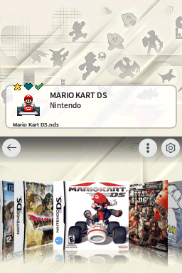
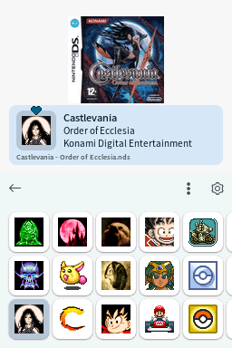
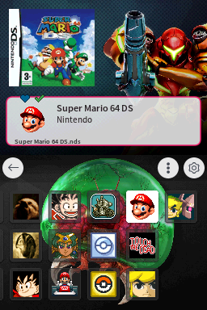
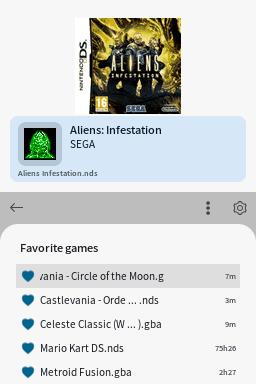
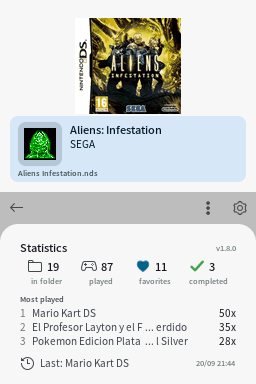

# Pico Launcher Enhanced 简体中文汉化分支

[](../../releases/latest)
[](../../releases)
[](LICENSE.txt)

> **汉化分支说明**
>
> 本仓库是 [Pico Launcher Enhanced](https://github.com/rasalopa/pico-launcher-enhanced) 的简体中文汉化分支，主要面向中文用户。
> 启动器界面已经全部汉化，并统一使用点阵字体绘制中文、英文、数字和符号。
> 仓库结构、安装方式和 SD 卡目录均与原版保持兼容。
> 英文说明请见 [README.en.md](README.en.md)。

这是 [LNH 团队](https://github.com/LNH-team) 的 [Pico Launcher](https://github.com/LNH-team/pico-launcher) 增强分支：加入了收藏、游玩统计、最近游玩等现代主机风格功能，同时完全兼容原版 SD 卡目录结构——可直接替换 `_picoboot.nds`，上游原有功能也全部保留。







*截图来自真机，使用启动器自带的截图快捷键（长按 START）保存。*

## 功能特性

原版 Pico Launcher 的所有功能都在（显示模式、游戏*和文件夹*的[自定义图标、横幅与封面](docs/Customization.md)、[主题](docs/Themes.md)、[金手指](docs/Cheats.md)、[文件关联](docs/FileAssociations.md) —— 详见[使用说明](docs/Usage.md)），此外还加入了：

- **按首字母跳转** —— 在按名称排序的文件夹中，按 L 或 R 跳到下一个首字母；顶栏小标签会显示当前所在的字母
- **游戏数量显示** —— 顶栏显示当前文件夹中的游戏数量
- **随机启动游戏** —— SELECT + A
- **收藏** —— 在游戏上按 X 收藏，顶栏会显示爱心标记
- **通关标记** —— 长按 X 标记为已通关，顶栏会显示绿色对勾
- **收藏与通关筛选** —— 应用栏中的爱心和对勾按钮，启用后会着色显示
- **收藏面板** —— 长按爱心按钮，查看所有文件夹中的收藏游戏；点击条目即可跳转
- **最近游玩面板** —— 应用栏中的时钟按钮；点击条目即可跳转到对应游戏
- **统计面板** —— 长按时钟按钮，查看总数和最常启动的游戏
- **截图** —— 长按 START 约半秒，将上下屏幕保存到 `/_pico/screenshots`
- **单游戏启动记录** —— 顶栏显示启动次数和最近游玩日期
- **大致游玩时长** —— 按游戏以及统计面板中显示
- **删除游戏** —— 垃圾桶按钮，确认后删除 ROM 及其存档
- **亮度控制** —— 在显示设置中调节 DS Lite 背光亮度
- **隐藏空文件夹** —— 可选；没有可玩内容的文件夹不会显示在列表中
- **更好用的金手指列表** —— 列表首尾可循环，按 X 可一键关闭全部金手指
- **顶栏信息在任何主题下都可读** —— 游戏数量和启动信息带有独立背景，[自定义主题](docs/Themes.md)还可以移动或隐藏它们
- **文件夹背景音乐** —— 将 `bgm.bcstm` 放入文件夹即可
- **时段主题背景** —— 可选夜间背景，在 20:00 至 6:59 之间显示
- **按文件保存游戏数据** —— 收藏、通关标记和统计属于 ROM 文件本身，两个同名游戏副本不会互相共享

每个功能的详细说明见[增强功能文档](docs/Enhanced.md)。

## 汉化与点阵字体

启动器界面已汉化为简体中文。界面中显示的所有字符——中文、英文、数字和标点——都来自同一套 9pt 文泉驿点阵宋体，并已转换为 Nitro Font 2 格式，存放于 `arm9/data/BitmapSong-9pt.nft2`。转换脚本为 `tools/make_chinese_bitmap_font.py`；字体采用 GNU GPL v2 + 字体嵌入例外授权，详见 [`licenses/wqy-bitmap-song.txt`](licenses/wqy-bitmap-song.txt)。

## 安装

1. 从[发布页面](../../releases)下载 `LAUNCHER.nds`。
2. 将其重命名为 `_picoboot.nds`，放到 SD 卡根目录，覆盖原文件。

不需要对 SD 卡做其他改动——原版安装中的主题、封面和 `_pico` 文件夹都可以继续使用。

> [!NOTE]
> 使用 Pico Launcher 时，SD 卡的 `/_pico` 目录中还需要有 Pico Loader 文件（`aplist.bin`、`savelist.bin`、`picoLoader7.bin` 和 `picoLoader9.bin`）。

## 环境准备

推荐使用 WSL（Windows Subsystem for Linux）或 MSYS2 来编译本项目。以下步骤假设你已经配置好其中一种环境。

1. 安装 [BlocksDS](https://blocksds.skylyrac.net/docs/setup/)
2. 拉取子模块：`git submodule update --init`

## 编译

1. 运行 `make`

如果没有在本地安装 BlocksDS，也可以使用 Docker 构建（与 CI 使用同一镜像）：

```sh
docker run --rm -v "$PWD":/work -w /work skylyrac/blocksds:slim-v1.16.0 make
```

启动器会生成在仓库根目录，文件名为 `LAUNCHER.nds`。

2. 将 `LAUNCHER.nds` 复制到 SD 卡。
    - 如果使用 DSpico，请重命名为 `_picoboot.nds` 并放到 SD 卡根目录。
3. 将 `_pico` 文件夹复制到 SD 卡根目录。

使用 DSpico 时，最终目录结构如下：
```
.
├── _pico
│   ├── themes
│   │   ├── material
│   │   │   └── theme.json
│   │   └── raspberry
│   │       ├── bannerListCell.bin
│   │       ├── bannerListCellPltt.bin
│   │       ├── bannerListCellSelected.bin
│   │       ├── bannerListCellSelectedPltt.bin
│   │       ├── bottombg.bin
│   │       ├── gridcell.bin
│   │       ├── gridcellPltt.bin
│   │       ├── gridcellSelected.bin
│   │       ├── gridcellSelectedPltt.bin
│   │       ├── scrim.bin
│   │       ├── scrimPltt.bin
│   │       ├── theme.json
│   │       └── topbg.bin
│   ├── aplist.bin
│   ├── savelist.bin
│   ├── picoLoader7.bin
│   └── picoLoader9.bin
└── _picoboot.nds
```
注意：如果想在 DSpico 上运行 DSiWare，还需要额外文件。详见 [Pico Loader](https://github.com/LNH-team/pico-loader) 的说明。

## 附加工具

[`tools/`](tools/) 目录中包含用于准备 SD 卡内容的桌面辅助脚本——封面转换与下载、横幅和图标生成、夜间背景生成等。详见[工具文档](docs/Tools.md)。

## 数据格式

本分支将每个游戏的数据（收藏、启动次数、游玩时间）保存在 `/_pico/gamedata.json` 中。每个条目属于一个 ROM 文件——如果收藏或游玩次数没有出现在你预期的位置，[数据存储](docs/Enhanced.md#data-storage) 中的表格解释了原因。文件格式本身记录在[游戏数据](docs/GameData.md)中，供工具作者参考。

## 贡献

欢迎提交问题、建议和 Pull Request——详见 [CONTRIBUTING.md](CONTRIBUTING.md)。

## 许可证

图标由 [icons8](https://icons8.com/) 提供。

`arm9/data/BitmapSong-9pt.nft2` 中的点阵字体来自文泉驿点阵宋体；详见 [`licenses/wqy-bitmap-song.txt`](licenses/wqy-bitmap-song.txt)。

本项目采用 Zlib 许可证，详见 `LICENSE.txt`。

项目可能还包含其他许可证，详见 `licenses` 目录。

## 贡献者

- [@Gericom](https://github.com/Gericom)
- [@XLuma](https://github.com/XLuma)
- [@Dartz150](https://github.com/Dartz150)
- [@lifehackerhansol](https://github.com/lifehackerhansol)

启动器的基础工作全部归功于 LNH 团队——本分支只是在他们出色工作的基础上继续完善。
